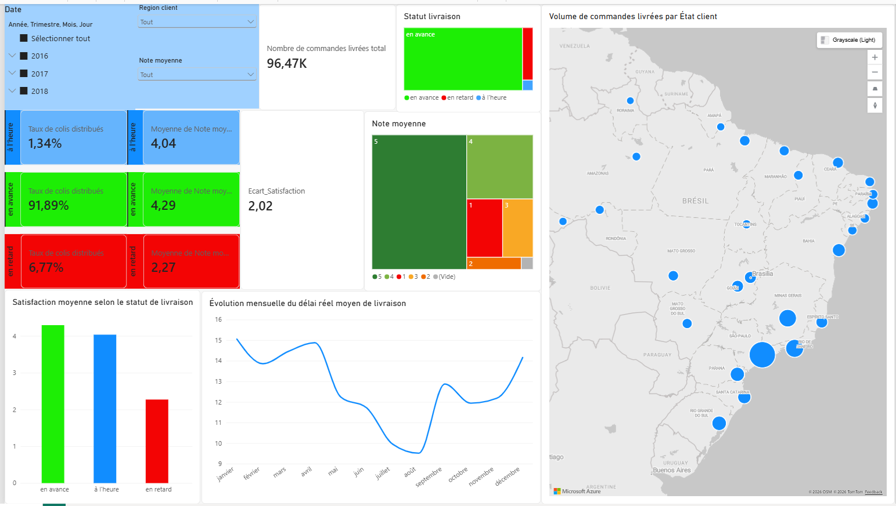

# Analyse de la performance logistique et de la satisfaction client
Analyse SQL & Power BI des délais de livraison, de la satisfaction client et des performances logistiques d'une plateforme e-commerce brésilienne.

## 📊 Présentation

Ce projet consiste à analyser les performances logistiques d'une plateforme e-commerce brésilienne et à étudier la relation entre les délais de livraison et la satisfaction client.

L'objectif était de transformer des données brutes en indicateurs métier exploitables à l'aide de **SQLite / SQL**, puis de présenter les résultats sous la forme d'un tableau de bord interactif avec **Power BI**.

---

## 🎯 Objectifs

- Contrôler la qualité et la cohérence des données.
- Mesurer les performances de livraison.
- Construire des indicateurs logistiques et de satisfaction client.
- Étudier la relation entre les délais de livraison et la satisfaction client.
- Analyser les performances selon les périodes et les États brésiliens.
- Préparer les données pour leur visualisation dans Power BI.

---

## 🔎 Contrôle qualité des données

Avant toute analyse, plusieurs contrôles ont été réalisés :

- Validation de la granularité des tables.
- Recherche de doublons.
- Contrôle des valeurs manquantes.
- Vérification de la cohérence des dates.
- Validation des clés utilisées pour les jointures.
- Vérification de la cohérence entre les dates de commande, de livraison et les dates promises.

Des anomalies mineures ont été identifiées, notamment certaines dates manquantes ou incohérentes.

Les données concernées ont été exclues des calculs nécessitant ces informations afin de préserver la fiabilité des indicateurs.

---

## 📈 Indicateurs construits

### Performance logistique

- Nombre de commandes livrées.
- Délai réel de livraison.
- Statut de livraison :
  - 🟢 En avance
  - 🔵 À l'heure
  - 🔴 En retard
- Taux de retard.
- Évolution mensuelle des performances de livraison.

### Satisfaction client

- Note moyenne par commande.
- Note moyenne selon le statut de livraison.
- Satisfaction selon le délai réel de livraison.
- Comparaison de la satisfaction entre les différents statuts de livraison.

### Analyse géographique

- Nombre de commandes par État.
- Délai moyen de livraison par État.
- Taux de retard par État.
- Satisfaction moyenne par État.

---

## 🧮 Analyse avec SQL

Les données ont été préparées et analysées avec **SQLite**.

Les principales fonctionnalités SQL utilisées sont :

- `JOIN`
- `GROUP BY`
- `CASE WHEN`
- `COUNT`
- `AVG`
- Agrégations conditionnelles
- Manipulation des dates avec `julianday()`

Une attention particulière a été portée à la granularité des données afin d'éviter les doublons lors des jointures.

Les commandes ayant reçu plusieurs avis ont notamment été agrégées afin d'obtenir une mesure cohérente de la satisfaction au niveau de la commande.

---

## 📊 Tableau de bord Power BI

Les données préparées avec SQL ont ensuite été utilisées pour construire un tableau de bord interactif dans Power BI.

Le dashboard permet notamment d'explorer :

- Le volume de commandes livrées.
- La répartition des livraisons selon leur statut.
- La satisfaction moyenne selon le statut de livraison.
- La distribution des notes clients.
- L'évolution mensuelle des délais de livraison.
- La répartition des commandes par État.
- Les performances logistiques selon les régions.

---

## 📌 Principaux résultats

Sur **96 470 commandes livrées analysées** :

| Indicateur | Résultat |
|---|---:|
| Commandes livrées | 96 470 |
| Livraisons en retard | 6,77 % |
| Note moyenne – en avance | 4,29 / 5 |
| Note moyenne – à l'heure | 4,04 / 5 |
| Note moyenne – en retard | 2,27 / 5 |
| Écart entre en avance et en retard | 2,02 points |

Les résultats mettent en évidence une association entre le statut de livraison et la satisfaction client.

Les commandes livrées en retard présentent une note moyenne nettement inférieure à celles livrées à l'heure ou en avance.

L'analyse porte sur les commandes ayant reçu au moins un avis client.

---

## 🛠️ Outils utilisés

- **SQLite**
- **SQL**
- **Power BI**

---

## 💡 Compétences développées

- Analyse exploratoire de données
- Contrôle qualité des données
- Nettoyage et préparation des données
- SQL
- Jointures entre plusieurs tables
- Agrégations et calcul de KPI
- Manipulation des dates avec SQLite
- Analyse de performance logistique
- Analyse de satisfaction client
- Analyse géographique
- Préparation des données pour la visualisation
- Data visualisation avec Power BI

---

## 🤖 Transparence sur l'utilisation de l'IA

Une intelligence artificielle a été utilisée comme support d'apprentissage pour approfondir certains concepts SQL, vérifier des approches techniques et améliorer la qualité de certaines requêtes.

Les analyses, contrôles qualité, choix méthodologiques, interprétation des résultats et conclusions présentés dans ce projet ont été personnellement réalisés, compris et validés.
